# Tutorial Apache Virtual Host
## Estructura de directorios

- creamos el directorio `websites`

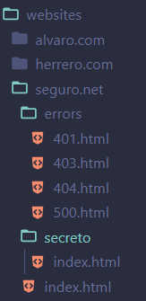

- creamos el directorio `sites-available`

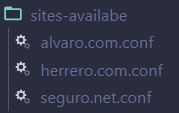

- creamos el directorio `scripts`

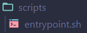

- creamos el directorio `htpasswd`

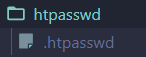

- creamos el directorio `sslcerts`

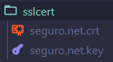

- creamos el `docker-compose.yml`


## Configuración Apache Virtual Host

- Lo primero que tenemos que hacer es crear un nuevo archivo en el directorio `sites-available` con el nombre deseado. En este caso `seguro.net.conf`.

una vez dentro del archivo, debemos agregar la siguiente información:

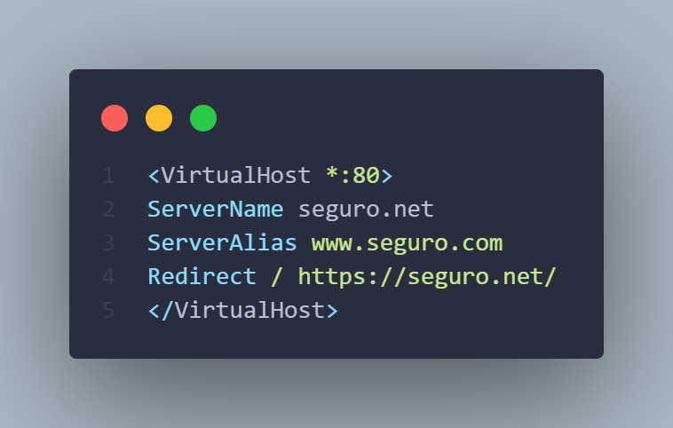

esto indica que cualquier petición que llegue al puerto 80 será redirigida al puerto 443 del contenedor.

- Ahora configuraremos el virtual host para el puerto 443.

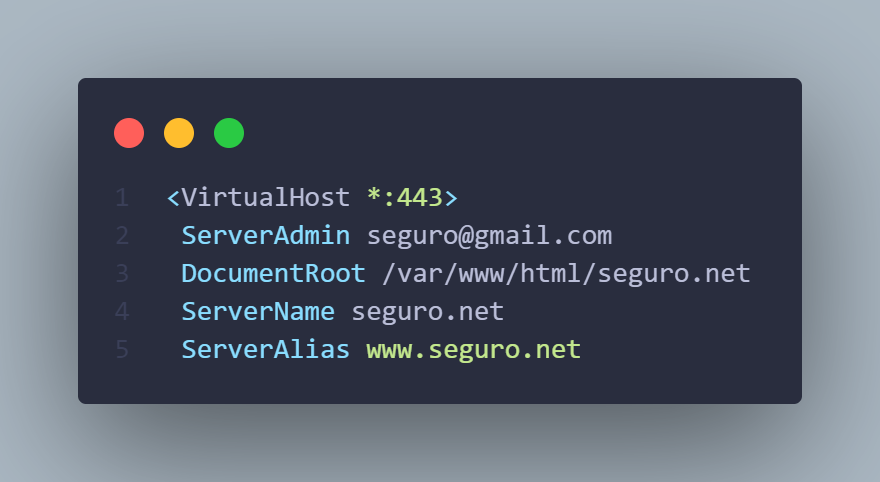

con este codigo indicamos con el DocumentRoot que la carpeta donde se encuentran los archivos del sitio web es `/var/www/html/seguro.net` y que tendra un nombre de host `seguro.net` y por ultimo tendrá un alias `www.seguro.net`.

- Seguiremos con el puerto 443 configurando las paginas de error.

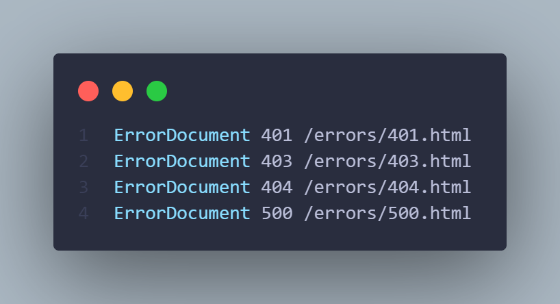

En esta parte le indicamos el error  y a continuacion la ruta donde se encuentran los archivos de error. es decir continuamos la ruta desde donde dejamos el **DocumentRoot hasta la carpeta con los errores.**

- Ahora habilitaremos el `certificado SSL` que posteriormente generaremos con la herramienta **`OpenSSL`**.

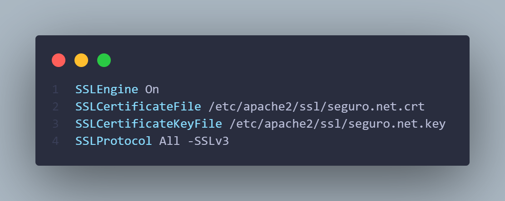

Aqui definimos que que vamos a habilitar el SSL, donde se encuentra nuestro certificado y nuestra key y que protocolo SSL vamos a usar.

- Por ultimo, configuraremos el acceso restringido a nuestro sitio web.

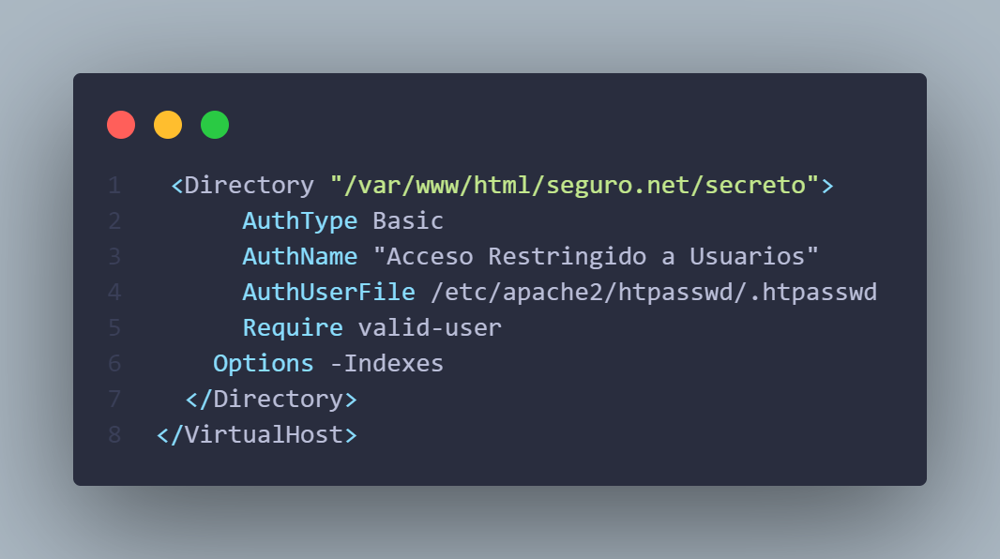

1. Donde estamos definiendo el directorio que queremos protejer.
2. El tipo de autenticación que vamos a usar es `Basic`
3. El mensajes que vamos a mostrar cuando salga el cuadro de identificacion
4. La ruta del archivo de contraseñas que vamos a usar.
5. Que solo los usuarios que esten en el archivo de contraseñas puedan acceder al sitio web.
6. Una opcion para que apache solo muestre algo si hay un index.html 

   
## Generar certificado SSL y contraseña con OpenSSL

- Primero debemos instalar OpenSSL en nuestra maquina.


- Ahora crearemos el certificado y la key con OpenSSL.

```bash
openssl req -x509 -nodes -days 365 -newkey rsa:2048 -keyout seguro.net.key -out seguro.net.crt
```
 pegaremos este comando en la **`Terminal propia de OpenSSL`** esto nos pedira que introduzcamos la información necesaria para crear el certificado y la key.

 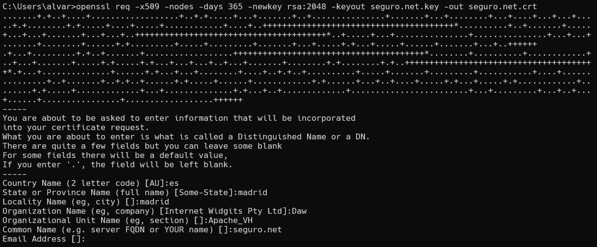

 tendremos en cuenta que en el Campo "Common Name" introducimos el nombre de nuestro dominio. En este caso es `seguro.net`.

 los 2 archivos que hemos generado son `seguro.net.key` y `seguro.net.crt` y los pegaremos en el directorio `sslcert` para que los pueda usar Apache.

 - Para generar la contraseña, utilizaremos el siguiente comando:
 
 ```bash
 openssl passwd
 ```

 esto nos pedira que introduzcamos una contraseña y nos generara un odigo que hace referencia a nuestra contraseña.

 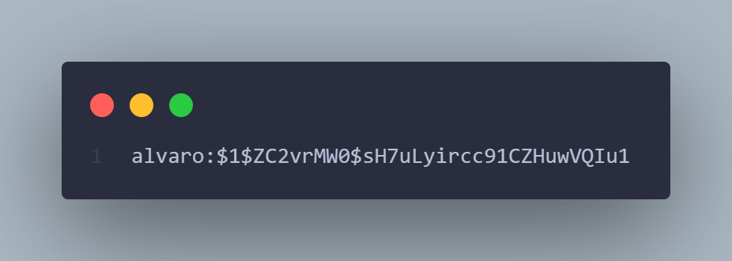

 dentro del archivo `htpasswd` escribiremos  `nombre del usuario : código generado por OpenSSL.`

 ## Script para habilitar y desabilitar los virtual host

 >[!NOTE]
 >Esta parte es opcional ya que podriamos hacerlo en la terminal propia de Docker.

 En el directorio `scripts` creamos un script llamado `entrypoint.sh` y lo editamos con el siguiente codigo:

 ```bash
 #!/bin/bash

#enlazamos el archivo de configuracion
#ln -s /etc/apache2/sites-available/alvaro.com.conf /etc/apache2/sites-enabled/alvaro.com.conf
#ln -s /etc/apache2/sites-available/herrero.com.conf /etc/apache2/sites-enabled/herrero.com.conf
a2ensite alvaro.com.conf
a2ensite herrero.com.conf
a2ensite seguro.net.conf
# habilitamos el modulo ssl
a2enmod ssl

#desenlazamos el archivo de configuracion default
#rm /etc/apache2/sites-enabled/000-default.conf
a2dissite 000-default.conf

#reiniciamos la configuracion apache
service apache2 reload

#ejecutamos apache 
apache2ctl -D FOREGROUND
```

1. habilitamos los virtual hosts con `a2ensite`
2. desabilitamos el virtual host default con `a2dissite`
3. habilitamos el modulo ssl con `a2enmod`
4. reiniciamos la configuracion apache con `service apache2 reload`
5. ejecutamos apache con `apache2ctl -D FOREGROUND`

## Docker Compose

```bash

services:
  apache: 
    image: ubuntu/apache2:latest
    container_name: apache
    ports:
      - 80:80
      - 443:443
    volumes:
      - ./websites:/var/www/html
      - ./sites-availabe:/etc/apache2/sites-available
      - ./sslcert:/etc/apache2/ssl
      - ./htpasswd:/etc/apache2/htpasswd
      - ./scripts:/scripts
    entrypoint: scripts/entrypoint.sh
```

- Este es el `docker-compose.yml` que nos permite crear y administrar nuestro Apache con Docker:
  - Se conecta a la imagen `ubuntu/apache2:latest`
  - El nombre del contenedor es `apache`
  - Se exponen los puertos 80 y 443 para acceder a nuestra web
  - Se montan los directorios necesarios para Apache:
   - `websites`: donde se encuentran los archivos del sitio web
   - `sites-available`: donde se encuentran los archivos de configuracion de los virtual hosts
   - `sslcert`: donde se encuentra el certificado y la key
   - `htpasswd`: donde se encuentra el archivo de contraseñas
   - `scripts`: donde se encuentra el script para habilitar y desabilitar los virtual hosts
  - El `entrypoint` se establece como `scripts/entrypoint.sh` que es el script que habilita y desabilita los virtual hosts

- Para levantar y tirar el docker compose, utilizamos los siguientes comandos:

```bash	
docker-compose up -d
docker-compose down
```

## Hosts File

>[!WARNING]
>Este archivos es delicado y se debe editar con cuidado ademas de hacer un backup del archivo original.

- Para que Apache pueda acceder a los virtual hosts, debemos agregar los nombres de nuestros dominios al archivo `C:\Windows\System32\drivers\etc\hosts`.

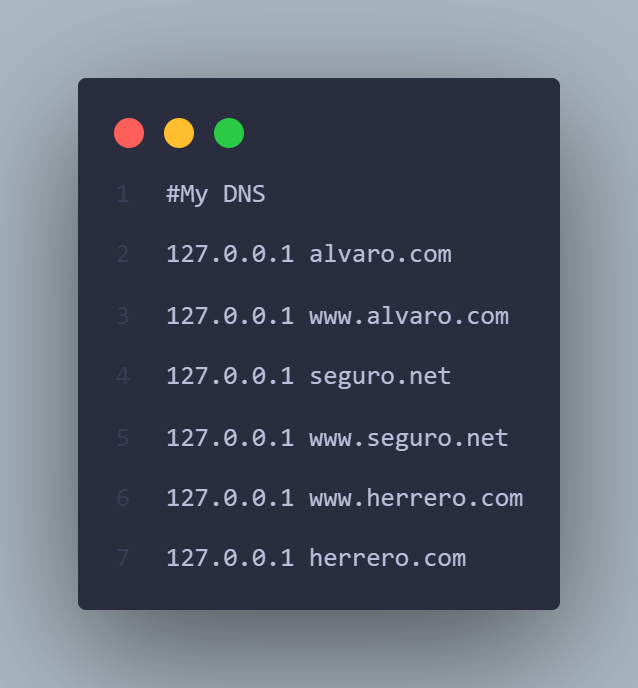

## Ejemplos de funcionamiento de la web

### Alvaro.com

- http://alvaro.com

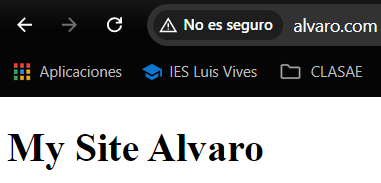

- error 404: http://alvaro.com/asdasd

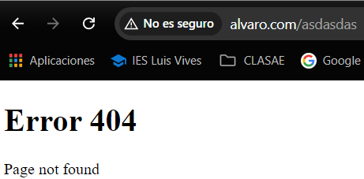

### Herrero.com

- http://www.herrero.com

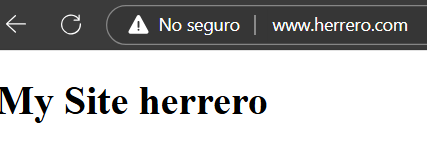

- error 404: http://www.herrero.com/asdasd

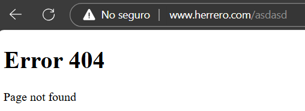

### Seguro.net

- https://seguro.net

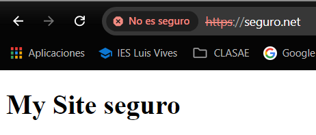

- https://seguro.net/secreto

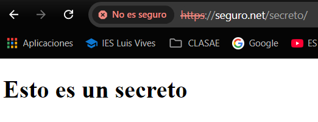

- error 401: https://seguro.net/secreto
 - cuando salta el cuadro de identificacion lo cerramos

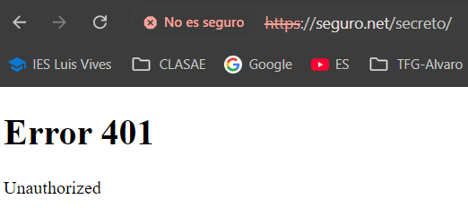

- error 404: https://seguro.net/asdasd

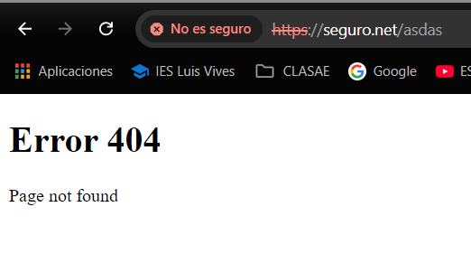

- error 403: https://seguro.net/secreto
- el nombre del archivo html dentro de seguro no es index-html

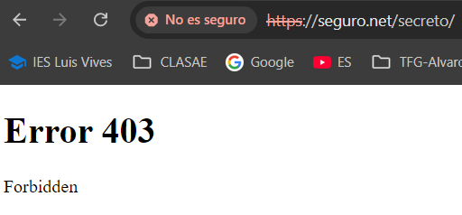

- error 500: https://seguro.net/error500
- cuando en la configuracion le decimos que busque la utenticacion en archivo que no existe

 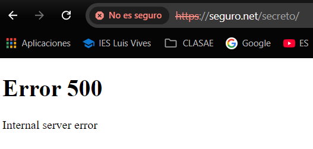


# Autor

Realizado por [Álvaro Herrero Tamayo](https://github.com/alvarito304)